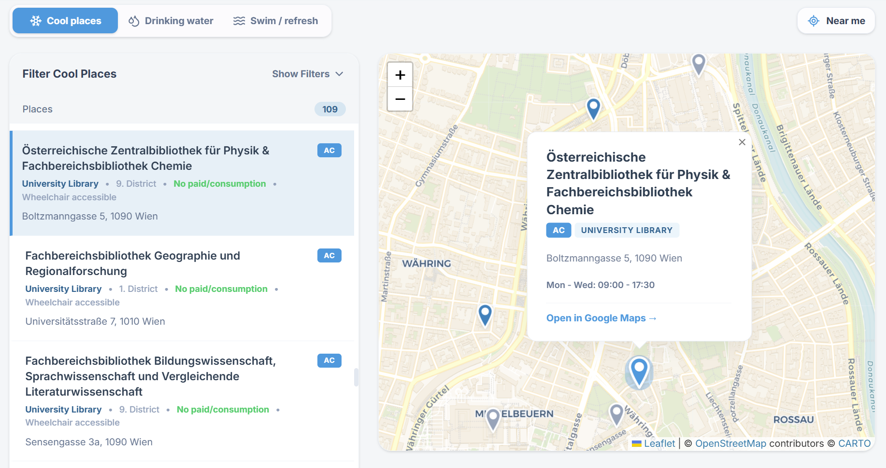

# Make Vienna Cool



Make Vienna Cool is an independent open-source project that helps people living in Vienna, or visiting Vienna, find places to cool down during heat waves, find public drinking water, locate monitored places to swim or refresh themselves, and find public toilets.

Too few homes in Vienna have air conditioning. During extreme heat this can become dangerous, especially for vulnerable people, older people, children, people with health conditions, and anyone who is overheated or has nowhere cool to rest. I could not find a comprehensive public map or database of air-conditioned and cool indoor public spaces in Vienna, so I started this project.

The City of Vienna already publishes its Coole Zonen list, and those spots are integrated here. That list is important, but it does not cover many other useful places such as libraries, malls, pubs, cafes, bookstores, fast-food places, and other low-barrier indoor spaces where people can sit for a while.

The app keeps four datasets separate in the interface and in source files:

- cool and air-conditioned places
- public drinking-water points
- monitored bathing sites and public water-refresh features
- public toilets

Most places in this database come from:

- the City of Vienna Coole Zonen list
- Reddit threads where Viennese people asked for help finding cool places
- OpenStreetMap places tagged with positive `air_conditioning=*` values
- City of Vienna Open Government Data for public drinking-water points
- City of Vienna Open Government Data for monitored bathing-water sites
- OpenStreetMap public-toilet points, with City of Vienna public-WC pages used as source context

Thank you to OpenStreetMap and its contributors. Without OpenStreetMap, this project would not be possible. Thank you also to data.gv.at, Austria's open-data portal, and to the City of Vienna Open Government Data program for curating and publishing the public open data used by this project.

## Why this project?

The urge to develop this project came from a practical gap: Google Maps does not offer an air-conditioning filter for places, and in my testing it was not very good at finding all of Vienna's public drinking-water fountains.

The City of Vienna does offer official maps for drinking-water fountains, places to swim, and public toilets, but those maps can be hard to navigate and are not optimized for mobile use. This project puts cool indoor places, public drinking water, swim/refresh spots, and public toilets into one mobile-friendly interface.

## Contributing

Make Vienna Cool is meant to be collaborative. The goal is to add as many useful places as possible and keep the database accurate over time.

In general, cool-place entries should be places where people can stop, sit, study, wait, rest, or spend some time. Places that people only pass through, such as grocery stores or short-stop retail spaces, should usually not be added.

Drinking-water, water-refresh, and public-toilet entries are separate datasets. Do not mix them into the cool-place list unless the location also independently qualifies as a place to spend time indoors or cool down.

Wrong-information reports and missing-place suggestions submitted through the app are automatically opened as issues in this repository, so they can be reviewed and fixed in public.

It is strictly forbidden to use this project to sponsor or promote commercial activities. The database is for public heat-safety help, not advertising. Contributions will be monitored with this in mind.

## Data Maintenance

The current place database lives in `src/data/`.

Future data-maintenance effort should focus mostly on expanding and improving the cool-places database. Drinking-water points, swim/refresh places, and public toilets are refreshed automatically every week. Successful refreshes are committed directly to the generated data files, including added/removed places, bathing-water quality and temperature, and public-toilet free/paid status.

- `vienna_cool_places.ts` and `osm_imported_places.ts` contain cool and air-conditioned places.
- `drinking_water_places.ts` contains generated public drinking-water points.
- `water_access_places.ts` contains generated bathing sites and public water-refresh features.
- `public_toilet_places.ts` contains generated public-toilet points.
- `auto_update_metadata.ts` records the last successful automatic refresh displayed in the app footer.
- `source_ignores.json` records source IDs that should stay intentionally excluded from generated datasets.
- `scripts/generate_water_places.mjs` regenerates the water files from downloaded City of Vienna WFS GeoJSON files.
- `scripts/generate_public_toilets.mjs` regenerates public toilets from an OpenStreetMap `amenity=toilets` export and can use the same compact Vienna address layer for clearer display names.
- `scripts/auto_update_data.mjs` downloads the source datasets, regenerates the generated files, validates them, and updates `auto_update_metadata.ts`.
- `scripts/open_auto_update_failure_issue.mjs` opens or updates a GitHub issue with logs when the scheduled update fails.

To run the full refresh locally:

```bash
npm run auto-update:data
```

The scheduled GitHub Actions workflow runs the same refresh weekly, then runs the TypeScript check and production build. If source APIs are unreachable, schemas change, generation fails, or validation fails, the workflow does not commit partial data. It opens or updates a GitHub issue containing the failure stage and log output so the deployed website can keep using the last successful committed data.

Ignored generated records should be added to `source_ignores.json` by source key, for example `trinkbrunnen:12345`, `badestellen:some-stable-id`, or `node:12345` for OpenStreetMap toilets. Private/customer-only toilets are also excluded by the generator.

Wrong-information reports and missing-place suggestions can be submitted through a Cloudflare Worker. Copy `wrangler.example.toml`, configure the Worker secrets, deploy the Worker, and set these frontend environment variables for the Vite app build. `VITE_REPORT_ENDPOINT` is not a Vite route; it is the frontend build variable used by the report and suggestion forms, and its value should be the deployed Worker URL:

```bash
VITE_REPORT_ENDPOINT=https://your-worker.example
VITE_TURNSTILE_SITE_KEY=your-turnstile-site-key
```

Store private report-flow secrets only in Cloudflare Worker secrets:

```bash
wrangler secret put TURNSTILE_SECRET_KEY
wrangler secret put GITHUB_TOKEN
```

Use a fine-grained GitHub token limited to issue read/write access on this repository. The token's repository access must include `tommasodesantis/Make_Vienna_Cool`; a token that says it does not have access to any repositories cannot open issues, even if the issue permission category is set to read/write. If a token has ever been pasted into chat, rotate it before saving it.

Use a bot or secondary GitHub account token for `GITHUB_TOKEN` if you want your main account to receive notifications. Set `GITHUB_ASSIGNEES` and `GITHUB_NOTIFY_USERS` in the Worker variables to the maintainer account that should be assigned and mentioned on submitted issues.

## Local Development

Prerequisite: Node.js.

```bash
npm install
npm run dev
```

The app is a Vite/React map application. The current place database lives in `src/data/`.

## License

This project is released under the MIT License. OpenStreetMap data is available under the Open Database License; see https://www.openstreetmap.org/copyright.
